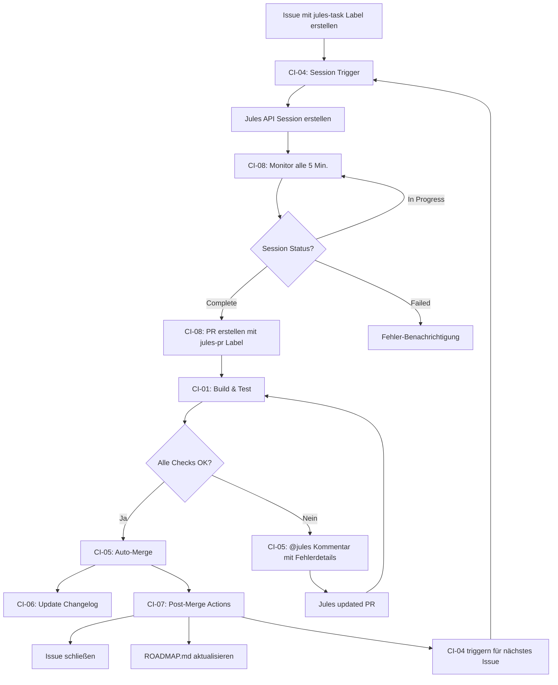

# Complete Jules Automation Workflow

> **Vollständig automatisierter CI/CD Prozess mit Jules Integration**

## 📊 Workflow Übersicht

Dieser Workflow implementiert eine vollständige, selbstlaufende Automatisierung für die Entwicklung mit Jules:



## 🔄 Detaillierter Ablauf

### Phase 1: Issue Erstellung & Session Start

**Schritt 1.1: Issue anlegen**
```
Aktion: Entwickler erstellt Issue mit Label "jules-task"
Trigger: Issue opened/labeled Event
Workflow: CI-04_session-trigger.yml
```

**Schritt 1.2: Jules Session erstellen**
```
- CI-04 wählt ältestes offenes jules-task Issue
- Erstellt Jules Session via API
- Kommentiert Issue mit Session-Link
- Session-ID wird für Monitoring gespeichert
```

### Phase 2: Session Monitoring & PR Erstellung

**Schritt 2.1: Kontinuierliche Überwachung**
```
Workflow: CI-08_monitor-jules-session.yml
Schedule: Alle 5 Minuten (cron: '*/5 * * * *')

Ablauf:
1. Finde alle offenen jules-task Issues
2. Extrahiere Session-IDs aus Kommentaren
3. Prüfe Status via Jules API für jede Session
4. Handle Status: COMPLETED, FAILED, oder IN_PROGRESS
```

**Schritt 2.2: PR Erstellung bei Completion**
```
Bedingung: Session Status = COMPLETED

Aktionen:
1. Extrahiere Branch-Name aus Session-Daten
2. Erstelle PR mit:
   - Title: "Jules: [Issue Title]"
   - Label: jules-pr
   - Body: Link zu Issue und Session
3. Kommentiere Issue: "PR erstellt"
```

### Phase 3: CI/CD Pipeline & Quality Checks

**Schritt 3.1: Automatische Tests**
```
Workflow: CI-01_build-and-test.yml
Trigger: PR opened/synchronize

Jobs:
1. Quality Check (Format, Lint)
2. Build & Test (Linux, macOS, Windows)
3. Security Audit
4. Success Gate
```

**Schritt 3.2: Check Status Monitoring**
```
Workflow: CI-05_pr-automation.yml
Trigger: 
  - check_suite completed
  - workflow_run completed (CI-01)
  - PR synchronize

Wartet auf:
- Alle Checks abgeschlossen
- Keine pending Checks
```

### Phase 4: Auto-Merge oder Error Handling

**Schritt 4.1: Success Path - Auto-Merge**
```
Bedingung: Alle Checks = SUCCESS

Aktionen:
1. Merge PR (squash)
2. Kommentar: "Auto-merged successfully"
3. Trigger CI-06 (Changelog)
4. Trigger CI-07 (Post-Merge)
```

**Schritt 4.2: Error Path - @jules Benachrichtigung**
```
Bedingung: Mindestens 1 Check = FAILED

Aktionen:
1. Sammle alle fehlgeschlagenen Checks
2. Erstelle detaillierten Fehlerreport:
   - Check-Name
   - Fehler-Summary
   - Link zu Details
3. Kommentiere PR: "@jules ⚠️ Checks Failed..."
4. Warte auf Jules Update
5. Bei Update → automatisch zurück zu Phase 3
```

**Schritt 4.3: Merge Conflict Handling**
```
Bedingung: PR.mergeable = false

Aktionen:
1. Kommentiere: "@jules ⚠️ Merge Conflicts"
2. Erkläre nächste Schritte
3. Warte auf Jules Fix
```

### Phase 5: Post-Merge Automation

**Schritt 5.1: Issue schließen**
```
Workflow: CI-07_post-merge-automation.yml
Trigger: PR closed & merged & jules-pr Label

Aktion:
1. Extrahiere Issue-Nummer aus PR Body
2. Schließe Issue
3. Kommentiere: "Completed in PR #X"
```

**Schritt 5.2: ROADMAP.md Update**
```
Aktion:
1. Finde Issue-Referenz in ROADMAP.md
2. Markiere als completed:
   - "- [ ]" → "- [x]"
   - "- 🚧" → "- ✅"
3. Füge PR-Link hinzu
4. Commit & Push
```

**Schritt 5.3: Nächste Session triggern**
```
Aktion:
1. Trigger CI-04 via workflow_dispatch
2. CI-04 wählt nächstes ältestes jules-task Issue
3. Zyklus startet von vorne
```

### Phase 6: Documentation Update

**Schritt 6.1: Changelog Update**
```
Workflow: CI-06_update-changelog.yml
Trigger: PR closed & merged

Aktion:
1. Füge Eintrag zu CHANGELOG.md hinzu
2. Format: "- DATE: TITLE (#PR)"
3. Commit & Push
```

## 🎯 Key Features

### ✨ Vollständige Automatisierung
- **Kein manueller Eingriff nötig** nach Initial-Setup
- **Selbst-fortsetzend**: Arbeitet alle jules-task Issues ab
- **24/7 Monitoring**: Kontinuierliche Überwachung

### 🛡️ Robuste Fehlerbehandlung
- **Intelligente Fehleranalyse** mit detaillierten Reports
- **Automatische Benachrichtigungen** an @jules
- **Retry-Mechanismus** durch Jules Updates
- **Merge Conflict Detection**

### 📝 Dokumentation & Tracking
- **Automatische ROADMAP Updates**
- **Changelog Maintenance**
- **Issue Tracking Comments**
- **PR Status Updates**

## 🔧 Konfiguration

### Voraussetzungen

1. **JULES_API_KEY Secret**
   ```bash
   gh secret set JULES_API_KEY
   # Key von https://jules.google.com
   ```

2. **Labels sync**
   ```bash
   gh label sync --file .github/labels.yml
   ```

3. **Workflows aktivieren**
   - Alle Workflow-Dateien müssen in main branch sein
   - GitHub Actions müssen aktiviert sein

### Erste Schritte

**Option A: Einzelnes Issue**
```bash
# 1. Issue erstellen mit jules-task Label
gh issue create --label "jules-task" --title "Task Title" --body "Description"

# 2. Workflow triggern (optional, läuft automatisch)
gh workflow run CI-04_session-trigger.yml

# 3. Monitoring prüfen
gh run list --workflow="Monitor Jules Session"
```

**Option B: Batch von Issues**
```bash
# 1. Alle Development Issues erstellen
gh workflow run CI-03_create-issues.yml

# 2. CI-04 triggern für erstes Issue
gh workflow run CI-04_session-trigger.yml

# 3. System läuft automatisch weiter
```

## 📊 Monitoring & Debugging

### Status prüfen

```bash
# Aktuelle Jules Tasks
gh issue list --label "jules-task"

# Aktive PRs
gh pr list --label "jules-pr"

# Letzte Workflow Runs
gh run list --limit 10

# Spezifischer Workflow
gh run list --workflow="Monitor Jules Session"
gh run list --workflow="PR Auto-Merge"
gh run list --workflow="Post-Merge Automation"
```

### Logs ansehen

```bash
# Letzter Run eines Workflows
gh run view --log

# Spezifischer Run
gh run view <run-id> --log

# Live-Monitoring
gh run watch
```

### Common Issues

**Problem: Session wird nicht erstellt**
```bash
# Check JULES_API_KEY
gh secret list | grep JULES

# Check Workflow Runs
gh run list --workflow="Session Trigger"

# Manual trigger
gh workflow run CI-04_session-trigger.yml -f issue_number=<N>
```

**Problem: PR wird nicht erstellt**
```bash
# Check Monitoring
gh run list --workflow="Monitor Jules Session"

# Check Issue Comments für Session-ID
gh issue view <issue-number> --comments

# Manual trigger Monitor
gh workflow run CI-08_monitor-jules-session.yml
```

**Problem: Auto-Merge funktioniert nicht**
```bash
# Check PR Status
gh pr view <pr-number> --json mergeable,statusCheckRollup

# Check für @jules Kommentare
gh pr view <pr-number> --comments

# Check Workflow
gh run list --workflow="PR Auto-Merge"
```

## 🎓 Best Practices

### Issue Creation

**Gute Issue-Beschreibung:**
```markdown
## Task
Clear description of what needs to be done

## Acceptance Criteria
- [ ] Criterion 1
- [ ] Criterion 2

## Technical Details
- Affected files
- Dependencies
- Test requirements
```

### Labels verwenden

```bash
# Pflicht
jules-task

# Optional aber empfohlen
priority: high
phase-2: multi-projector
component: core
```

### Monitoring Setup

**Dashboard Commands:**
```bash
# Status-Overview erstellen
echo "=== Jules Tasks ==="
gh issue list --label "jules-task" --state open

echo "=== Active PRs ==="
gh pr list --label "jules-pr"

echo "=== Recent Runs ==="
gh run list --limit 5
```

## 📈 Success Metrics

### Aktuelle Ziele
- ✅ **Session Success Rate:** >95%
- ✅ **Auto-Merge Rate:** >90%
- ✅ **Average Cycle Time:** <30 Min (Issue → Merge)
- ✅ **Error Recovery Time:** <10 Min
- ✅ **Documentation Coverage:** 100%

### Tracking

```bash
# Erfolgsrate berechnen
TOTAL=$(gh issue list --label "jules-task" --state closed --limit 100 | wc -l)
SUCCESS=$(gh pr list --label "jules-pr" --state merged --limit 100 | wc -l)
echo "Success Rate: $((SUCCESS * 100 / TOTAL))%"
```

## 🔮 Future Enhancements

### Geplante Features
- [ ] Parallel Session Support (mehrere Issues gleichzeitig)
- [ ] Priority-based Queue Management
- [ ] Advanced Error Recovery Strategies
- [ ] Performance Metrics Dashboard
- [ ] Slack/Discord Integration für Notifications
- [ ] Automatic Rollback bei Critical Failures

### In Diskussion
- [ ] Machine Learning für Session Time Prediction
- [ ] Automatic Issue Prioritization
- [ ] Smart Branch Naming Strategy
- [ ] Enhanced ROADMAP Integration

## 📚 Referenzen

- **Jules API Docs:** https://jules.google.com/docs
- **GitHub Actions:** https://docs.github.com/actions
- **Workflow Syntax:** https://docs.github.com/actions/reference/workflow-syntax-for-github-actions

## 🆘 Support

**Probleme?**
1. Check [Troubleshooting](#monitoring--debugging)
2. Review Workflow Logs
3. Open Issue mit Label `workflows`
4. Kontakt: @MrLongNight

---

**Version:** 1.0  
**Status:** ✅ Production Ready  
**Last Updated:** 2024-12-04

**🚀 Der Workflow läuft jetzt vollautomatisch!**
