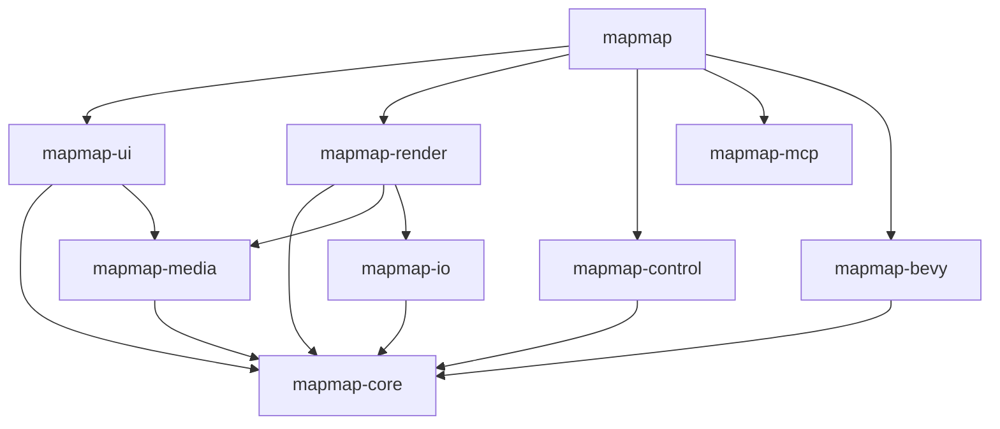

# MapFlow – Vollständige Roadmap und Feature-Status

> **Version:** 2.1
> **Stand:** 2026-02-17 10:00
> **Zielgruppe:** @Projektleitung und Entwickler-Team
> **Projekt-Version:** 0.2.1

---

## 📋 Inhaltsverzeichnis

1. [Fokus & Ziele für Release 1.0](#fokus--ziele-für-release-10)
2. [Feature-Status-Übersicht](#feature-status-übersicht)
3. [Architektur und Crate-Übersicht](#architektur-und-crate-übersicht)
4. [Multi-PC-Architektur (Phase 8)](#multi-pc-architektur-phase-8--neu)
5. [Arbeitspakete für @jules](#arbeitspakete-für-jules)
6. [Task-Gruppen (Adaptiert für Rust)](#task-gruppen-adaptiert-für-rust)
7. [Implementierungsdetails nach Crate](#implementierungsdetails-nach-crate)
8. [Technologie-Stack und Entscheidungen](#technologie-stack-und-entscheidungen)
9. [Build- und Test-Strategie](#build--und-test-strategie)

---

## Fokus & Ziele für Release 1.0

Basierend auf dem aktuellen Status und den Projektzielen für die erste produktive Version (v1.0):

### A) Render Pipeline & Module Logic

* **Priorität:** 🔥 **CRITICAL**
* **Ziel:** Eine fehlerfreie Render-Pipeline, in der alle Modul-Nodes und die zugehörige Logik stabil funktionieren.
* **Status:** In Stabilisierung. Main Application Entry Point implementiert (2026-01-31). Laufende Bugfixes und Node-Stabilisierung.
* **Maßnahme:** "Broken Nodes" reparieren. Experimentelle Features (wie NDI/Multi-PC) ggf. ausklammern oder verstecken, falls sie die Stabilität gefährden.

### B) Timeline Integration (V3)

* **Priorität:** 🚀 **HIGH**
* **Ziel:** Vollständige Integration der Module in die Timeline.
* **Funktionalität:**
  * Jeder Parameter eines Nodes (z.B. "Blur Amount") soll via Trigger-Nodes und Verbindungen definiert werden können.
  * Arrangement der konfigurierten Module in der Timeline.
  * Unterstützung für **Manuelle**, **Hybride** und **Vollautomatische** Steuerung.
  * Möglichkeit, Parameter bei Bedarf manuell zu triggern.

### C) Stabilität & Performance

* **Priorität:** 🛡️ **HIGH**
* **Ziel:** Fixen von Fehlern und Problemen, Verbesserung der Performance.
* **Cleanup:** Entfernen von UI-Elementen, die keine Funktion haben.
* **Refactoring:** Aufteilung übergroßer Dateien (insb. `module_canvas/mod.rs`).

### D) Release-Artefakte

* **Priorität:** 📦 **REQUIRED**
* **Lieferumfang:**
  * Produktive Version von MapFlow (v1.0).
  * Fertiger Installer für **Windows** (.msi/.exe) und **Linux** (.deb/AppImage).
  * Handbuch in Form von **GitHub Wiki**-Beiträgen.

---

## Feature-Status-Übersicht

### General Updates

* ✅ **Rebranding: VjMapper -> MapFlow** (COMPLETED 2025-12-22)
  * ✅ Rename Project (2025-12-22)
  * ✅ Update UI Strings & Docs (2025-12-22)
  * ✅ Rename WiX Installer Config (2025-12-22)

### Core / Layer / Mapping System

* ✅ **Layer-System** (`mapmap-core/src/layer.rs`)
  * ✅ Transform-System (Position, Rotation, Scale)
  * ✅ Opacity-Steuerung (0.0-1.0)
  * ✅ Blend-Modi (Normal, Add, Multiply, Screen, Overlay, etc.)
  * ✅ ResizeMode (Fill, Fit, Stretch, Original)
  * ✅ LayerManager für Komposition
  * ✅ Hierarchisches Layer-System

* ✅ **Mapping-System** (`mapmap-core/src/mapping.rs`)
  * ✅ Mapping-Hierarchie (Paint → Mapping → Mesh)
  * ✅ MappingManager für Verwaltung
  * ✅ Mapping-IDs und Referenzen

* ✅ **Mesh-System** (`mapmap-core/src/mesh.rs`)
  * ✅ MeshVertex mit UV-Koordinaten
  * ✅ BezierPatch für Warping
  * ✅ Keystone-Korrektur
  * ✅ MeshType (Quad, Grid, Custom)

* ✅ **Paint-System** (`mapmap-core/src/paint.rs`)
  * ✅ Paint als Basis-Datenstruktur
  * ✅ Media-Source-Integration

* ✅ **Trigger-System** (`mapmap-core/src/module_eval.rs`)
  * ✅ Stateful Triggers (Random Interval)
  * ✅ Trigger State Infrastructure
  * ✅ AudioFFT Trigger Completion (2026-01-15)

### 3D / Bevy Integration

* ✅ **Bevy Engine Integration** (Bevy 0.16)
  * ✅ Shared WGPU Context
  * ✅ Bevy Particles Node (Custom Mesh-Based) (COMPLETED 2026-02-10)
  * ✅ Bevy 3D Text Node (COMPLETED 2026-02-10)

### Rendering (Compositor / Edge-Blend / Color-Calib / Mesh / Oszillator / Effekt-Chain)

* ✅ **Compositor** (`mapmap-render/src/compositor.rs`)
  * ✅ Multi-Layer-Komposition
  * ✅ Blend-Modi-Unterstützung
  * ✅ GPU-beschleunigte Rendering-Pipeline
  * ✅ Texture-Caching und Upload-Optimierung

* ✅ **Edge-Blend-Renderer** (`mapmap-render/src/edge_blend_renderer.rs`)
  * ✅ GPU-Shader-basiertes Edge-Blending
  * ✅ Gamma-Korrektur
  * ✅ Blend-Zonen-Konfiguration
  * ✅ Multi-Projektor-Unterstützung
  * ✅ WGSL-Shader: `shaders/edge_blend.wgsl`

* ✅ **Color-Calibration-Renderer** (`mapmap-render/src/color_calibration_renderer.rs`)
  * ✅ Per-Output-Farbkalibrierung
  * ✅ RGB-Gain/Offset-Steuerung
  * ✅ Gamma-Kurven
  * ✅ WGSL-Shader: `shaders/color_calibration.wgsl`

* ✅ **Mesh-Renderer** (`mapmap-render/src/mesh_renderer.rs`)
  * ✅ Bezier-basiertes Mesh-Warping
  * ✅ GPU-Vertex-Transformation
  * ✅ Texture-Mapping auf Meshes
  * ✅ WGSL-Shader: `shaders/mesh_warp.wgsl`

* ✅ **Oscillator-Renderer** (`mapmap-render/src/oscillator_renderer.rs`)
  * ✅ GPU-basierte Oszillator-Simulation
  * ✅ Distortion-Effekte
  * ✅ WGSL-Shader: `shaders/oscillator_simulation.wgsl`, `shaders/oscillator_distortion.wgsl`

* ✅ **Blend-Modi-Shader** (`shaders/blend_modes.wgsl`)
  * ✅ 10+ Blend-Modi implementiert (Normal, Add, Multiply, Screen, Overlay, SoftLight, HardLight, ColorDodge, ColorBurn, Difference)

* ✅ **LUT-Color-Grading** (`shaders/lut_color_grade.wgsl`, `mapmap-core/src/lut.rs`)
  * ✅ 3D-LUT-Unterstützung
  * ✅ LUT-Format-Parser (.cube)
  * ✅ LUT-Manager mit Presets
  * ✅ GPU-beschleunigte Color-Grading

* ✅ **Effekt-Chain-Hooks**
  * ✅ Pluggable Effect System integriert
  * ✅ Post-FX-Pipeline verdrahtet
  * ✅ Effect-Parameter-Binding an UI vorhanden
  * ✅ Real-time Effect Hot-Reload implementiert

### Audio (Plattformspezifische Backends, Analyzer/Mapping)

* ✅ **Audio-Analyse** (`mapmap-core/src/audio/analyzer_v2.rs`) – **COMPLETED (2025-12-29)**
  * ✅ Implementiert als `AudioAnalyzerV2` (ersetzt V1)
  * ✅ FFT-Analyse mit RustFFT
  * ✅ 9 Frequenzbänder (SubBass, Bass, LowMid, Mid, HighMid, UpperMid, Presence, Brilliance, Air)
  * ✅ RMS-Volume-Analyse
  * ✅ Peak-Detektion
  * ✅ Beat-Detection (einfach, bassbasiert)
  * ✅ Ring-Buffer-Management für effiziente Verarbeitung
  * ✅ Hann-Window-Funktion für bessere Frequenzauflösung
  * ✅ Konfigurierbare FFT-Größe, Overlap und Smoothing
  * ✅ **Module Canvas Integration:** Live-Trigger-Visualisierung
    * ✅ VU-Meter auf AudioFFT-Trigger-Nodes
    * ✅ Threshold-Linie angezeigt
    * ✅ Glow-Effekt bei Trigger-Aktivierung

* ✅ **Audio-Reactive-System** (`mapmap-core/src/audio_reactive.rs`)
  * ✅ AudioReactiveController für Parameter-Mapping
  * ✅ AudioReactiveAnimationSystem
  * ✅ AudioMappingType (Volume, FrequencyBand, Beat, Onset, Spectral)
  * ✅ Audio-zu-Parameter-Mappings mit Smooth/Attack/Decay
  * ✅ Performance Optimization: Arc<Vec> & Zero-Alloc Update (2026-02-11)

* ✅ **Audio-Backend-Integration** (COMPLETED 2025-12-19)
  * ✅ CPAL-Backend verdrahtet (Feature: `audio` in `mapmap-core/Cargo.toml`)
  * ✅ Windows: WASAPI-Backend über CPAL integriert
  * ✅ Linux: ALSA/PulseAudio-Backend über CPAL integriert
  * ⬜ macOS: CoreAudio-Backend (optional, ungetestet)
  * ✅ Audio-Input-Device-Auswahl in UI (Dashboard)
  * ✅ Audio-Device-Persistenz in UserConfig (COMPLETED 2025-12-29)
  * ✅ Audio-Stream in Media-Pipeline verdrahtet (COMPLETED 2025-12-23)
  * ✅ Latenz-Kompensation implementiert (COMPLETED 2025-12-23)

* ✅ **Audio-Build-Enforcement**
  * ✅ Default-Feature `audio` in Workspace aktivieren (aktuell optional)
  * ✅ CI/CD: Audio-Feature in Tests aktivieren
  * ✅ Dokumentation: Audio als Pflicht-Dependency markieren

### Media (FFmpeg-Decode / Playback-Control / GPU-Upload)

* ✅ **FFmpeg-Decoder** (`mapmap-media/src/decoder.rs`)
  * ✅ FFmpeg-Integration über `ffmpeg-next` (optional feature)
  * ⬜ Video-Decode mit Hardware-Acceleration-Support
  * ⬜ Multi-threaded Decode-Pipeline
  * ⬜ Frame-Queue-Management

* ✅ **libmpv Integration** (`mapmap-media/src/mpv_decoder.rs`) – **COMPLETED (2026-01-09)**
  * ✅ `libmpv2` crate integration (optional feature `libmpv`)
  * ✅ Alternative decoder backend
  * ✅ Fallback strategy implementation

* ⬜ **Image-Decoder** (`mapmap-media/src/image_decoder.rs`)
  * ⬜ PNG, JPG, BMP, TGA Support
  * ⬜ Image-Crate-basierte Dekodierung
  * ⬜ GIF-Animation vollständig implementiert (COMPLETED 2025-12-23)
  * ⬜ Image-Sequence-Playback via walkdir (COMPLETED 2025-12-23)

* ✅ **Player** (`mapmap-media/src/player.rs`)
  * ✅ Robust State-Machine (Idle, Loading, Playing, Paused, Stopped, Error)
  * ✅ PlaybackCommand System
  * ✅ PlaybackStatus Channel
  * ✅ Simplified Loop-Modi (Loop, PlayOnce) - Legacy modes removed
  * ✅ Frame-Seeking & Timestamp-Management
  * ✅ Reverse Playback & Speed Control (COMPLETED 2026-01-10)
  * ✅ Flip (Horizontal/Vertical) Support (COMPLETED 2026-01-10)
  * ✅ Interactive Clip Region (Fluid drag & snap) (COMPLETED 2026-01-16)
  * ⬜ Es gibt noch diverse Funktionen in der Media Node die nicht korrekt funktionieren

* ✅ **Pipeline** (`mapmap-media/src/pipeline.rs`)
  * ✅ Media-Pipeline-Abstraktion
  * ✅ Async-Channel-basierte Frame-Delivery
  * ✅ Thread-Pool-Integration

* ✅ **GPU-Upload-Optimierung** (COMPLETED 2025-12-23)
  * ✅ Texture-Upload-Benchmark vorhanden (`mapmap-render/benches/texture_upload.rs`)
  * ✅ Staging-Buffer-Pool für asynchronen Upload implementiert
  * ✅ Automatische Entscheidung staging vs. direct basierend auf Textur-Größe
  * ⬜ Hardware-Decode-zu-GPU-Direct-Upload fehlt (benötigt FFmpeg HW-Accel Integration)

* ⬜ **Codec-Support**
  * ✅ H.264, H.265, VP8, VP9 über FFmpeg
  * ⬜ ProRes noch nicht getestet/optimiert
  * ✅ **HAP-Codec (COMPLETED 2025-12-31)**
    * ✅ HAP Decoder Modul (`mapmap-media/src/hap_decoder.rs`)
    * ✅ Snappy Dekompression für HAP-Frames
    * ✅ BC1/BC3 Textur-Upload (`mapmap-render/src/compressed_texture.rs`)
    * ✅ YCoCg→RGB Shader (`shaders/ycocg_to_rgb.wgsl`)
    * ✅ HAP Video Player (`mapmap-media/src/hap_player.rs`)
    * ✅ Auto-Erkennung bei .mov-Dateien in `open_path()`
    * ✅ MediaBrowser: Hap MediaType mit ⚡ Icon
    * ⬜ Runtime-Test mit echtem HAP-Video (benötigt FFmpeg)
  * ⬜ DXV-Codec fehlt

### Effects / PostFX

* ✅ **LUT-Color-Grading** (siehe oben)
* ✅ **Blend-Modi** (siehe oben)
* ✅ **Oscillator-Effekte** (siehe oben)
* ✅ **Animation-System** (`mapmap-core/src/animation.rs`)
  * ✅ Keyframe-Animation
  * ✅ AnimationClip und AnimationPlayer
  * ✅ Interpolation-Modi (Linear, Cubic, Step)
  * ✅ TimePoint-basiertes Timing
  * ⬜ Konzept der Effekt Nutzung völlig geändert (Modul Node Konzept)

* ✅ **Shader-Graph-System** (`mapmap-core/src/shader_graph.rs`)
  * ✅ Node-basiertes Shader-System
  * ✅ ParameterValue-System (Float, Vec2, Vec3, Vec4, Color, etc.)
  * ✅ Node-Connections und Graph-Traversal
  * ✅ WGSL-Codegen (`mapmap-core/src/codegen.rs`)

* ✅ **Effect-Chain-Integration (COMPLETED 2025-12-31)**
  * ✅ Shader-Graph in Render-Pipeline integriert (`shader_graph_integration.rs`)
    * ✅ ShaderGraphManager für Graph-Verwaltung
    * ✅ WGSLCodegen → GPU Pipeline Kompilierung
    * ✅ ShaderGraphRendering Trait für Rendering
  * ✅ **Custom-Shader-Hot-Reload** (`hot_reload.rs`)
    * ✅ File-Watcher für .wgsl Dateien
    * ✅ Debouncing (100ms)
    * ✅ Fallback zu letztem funktionierenden Shader
    * ✅ HotReloadIntegration für EffectChainRenderer
  * ✅ **Recent Effect Configs (GIMP-Style)** (`recent_effect_configs.rs`)
    * ✅ Speichert automatisch letzte 5 Configs pro Effekt-Typ
    * ✅ Duplikat-Erkennung (gleiche Configs werden nicht doppelt gespeichert)
    * ✅ Auto-generierte beschreibende Namen aus Parametern
    * ✅ JSON-Persistenz in User-Data-Verzeichnis
  * ✅ **Effect-Parameter-Automation via Timeline** (`effect_animation.rs`)
    * ✅ EffectParameterAnimator verbindet Animation-System mit Effekten
    * ✅ Keyframe-Animation für beliebige Parameter (Float, Vec3, Color, etc.)
    * ✅ Binding-System (`EffectParameterBinding`) für Parameter-zu-Track Mapping
    * ✅ Playback-Controls (Play, Pause, Seek, Speed, Loop)
    * ⬜ Es gibt noch sehr viele Probleme und Fehler in verschiedenen Modul Nodes und der Render Pipeline

### Control (OSC als Hauptpfad / MIDI low priority)

* ✅ **OSC-System** (`mapmap-control/src/osc/`)
  * ✅ OSC-Server (`osc/server.rs`) mit UDP-Socket
  * ✅ OSC-Client (`osc/client.rs`) für Outgoing-Messages
  * ✅ OSC-Address-Parser (`osc/address.rs`)
  * ✅ OSC-zu-Control-Value-Mapping (`osc/types.rs`)
  * ✅ Feature-Flag: `osc` (optional, muss aktiviert werden)

* ✅ **OSC-Integration (HAUPTPFAD – IMPLEMENTIERT)**
  * ✅ OSC-Command-Schema definiert und dokumentiert
  * ✅ OSC-Events an `ControlTarget`s geroutet
  * ✅ OSC-Feedback (State-Updates zurück an Controller) implementiert
  * ✅ Simplified OSC-Mapping (HashMap) - Legacy Learn Mode removed
  * ✅ UI: OSC-Server-Status und Port-Konfiguration implementiert (mit `imgui`)
  * ✅ Default-OSC-Port: 8000 (konfigurierbar)
  * 🟡 Neue Trigger-Nodes: Ableton Link (Tempo/Phase) & MIDI Clock (24 PPQ Divider) – Basis über `ableton-link-rs`

* ⬜ **MIDI-System (LOW PRIORITY)** (`mapmap-control/src/midi/`) - FULLY WIRED 2025-12-27
  * ✅ MIDI-Input (`midi/input.rs`)
  * ✅ MIDI-Output (`midi/output.rs`)
  * ✅ MIDI-Mapping (`midi/mapping.rs`) - Simplified HashMap implementation
  * ✅ MIDI-Learn Modul (`midi/midi_learn.rs`) - WIRED TO UI 2025-12-27
  * ✅ MIDI-Clock (`midi/clock.rs`)
  * ✅ MIDI-Profiles (`midi/profiles.rs`)
  * ✅ Ecler NUO 4 Profil (`midi/ecler_nuo4.rs`) - 89 Mappings
  * ✅ Feature-Flag: `midi` (optional)
  * ✅ Auto-Connect zu erstem verfügbaren Port - IMPLEMENTED 2025-12-27
  * ✅ MIDI Port-Auswahl in Settings - IMPLEMENTED 2025-12-27
  * ✅ MIDI-Learn im Module Canvas verdrahtet - IMPLEMENTED 2025-12-27
  * ⬜ MIDI-zu-Parameter-Routing für Layer/Effects (low priority)

* ✅ **WebSocket-System** (`mapmap-control/src/web/`) – NICHT NUTZEN
  * ✅ WebSocket-Server vorhanden (`web/websocket.rs`)
  * ✅ Web-API-Routes (`web/routes.rs`, `web/handlers.rs`)
  * ✅ **Entscheidung: WebSocket NICHT als Control-Pfad nutzen, OSC priorisieren**

* ⬜ **DMX-System** (`mapmap-control/src/dmx/`) – FUTURE
  * ⬜ Art-Net (`dmx/artnet.rs`)
  * ⬜ sACN (`dmx/sacn.rs`)
  * ⬜ DMX-Channel-Mapping (`dmx/channels.rs`)
  * ⬜ DMX-Fixtures (`dmx/fixtures.rs`)
  * ⬜ Nicht sofort erforderlich, für Phase 4+

* ✅ **Cue-System** (`mapmap-control/src/cue/`) – **In Timeline integriert**
  * ✅ Cue-Struktur (`cue/cue.rs`)
  * ✅ CueList (`cue/cue_list.rs`)
  * ✅ Crossfade (`cue/crossfade.rs`)
  * ✅ Triggers (`cue/triggers.rs`)
  * ℹ️ Kein separates Cue-Panel – Funktionalität via Timeline-Modi (siehe Phase 7)

* ⬜ **Shortcuts** (`mapmap-control/src/shortcuts/`)
  * ✅ Keyboard-Shortcuts (`shortcuts/shortcuts.rs`)
  * ✅ Bindings (`shortcuts/bindings.rs`)
  * ✅ Macros (`shortcuts/macros.rs`)
  * ⬜ Shortcut-UI fehlt

### UI (ImGui / egui)

* ✅ **UI-Framework-Status**
  * ❌ ImGui entfernt (Phase 6 Complete - 2025-12-23)
  * ✅ egui-Integration (`egui`, `egui-wgpu`, `egui-winit`, `egui_dock`, `egui_extras`)
  * ✅ **Phase 6: Migration von ImGui zu egui ABGESCHLOSSEN**
  * ⬜ WGPU 0.27, Winit 0.30 & Egui 0.33 Upgrade ist jetzt vollständig abgeschlossen aber es gibt noch diverse Fehler die gerade gefixt werden

* ✅ **UI-Module (Migriert zu egui)** (`mapmap-ui/src/`)
  * ✅ Dashboard (`dashboard.rs`) – Hauptansicht
  * ✅ Media-Browser (`media_browser.rs`) – Datei-Auswahl
  * ✅ Mesh-Editor (`mesh_editor.rs`) – Mesh-Warping-UI
  * ✅ Node-Editor (`node_editor.rs`) – Shader-Graph-Editor
  * ✅ Timeline V2 (`timeline_v2.rs`) – Keyframe Animation
  * ✅ Undo-Redo (`undo_redo.rs`) – Command-Pattern
  * ✅ Asset-Manager (`asset_manager.rs`)
  * ✅ Theme (`theme.rs`)
  * ⬜ Es gibt diverse UI Elemente die keine Funktion haben und entfernt werden müssen
  * ⬜ Es gibt diverse UI Elemente die noch nicht wie gewünscht implementiert sind

* ✅ **UI Panel Migration Status (egui)** – COMPLETED (2025-12-23)
  * ✅ Transform Controls (`transform_panel.rs`) – Migriert
  * ✅ Paint Manager (`paint_panel.rs`) – Migriert
  * ✅ Audio Visualization (`audio_panel.rs`) – Migriert
  * ✅ Main Menu & Toolbar (`menu_bar.rs`) – Migriert
  * ✅ Layer Manager (`render_layer_panel`) – Migriert (COMPLETED 2025-12-22)
  * ✅ Mapping Manager (`render_mapping_panel`) – Migriert (COMPLETED PR #97, 2025-12-23)
  * ✅ Output Configuration (`output_panel.rs`) – Migriert (COMPLETED 2025-12-23)
  * ✅ Edge Blend & Color Calibration (`edge_blend_panel.rs`) – Migriert (COMPLETED Verified 2025-12-23)
  * ✅ Oscillator Control (`oscillator_panel.rs`) – Migriert (COMPLETED Verified 2025-12-23)
  * ✅ Shader Graph Editor (`node_editor.rs`) – Migriert (COMPLETED 2025-12-23)
  * ✅ Cue List (`cue_panel.rs`) – Migriert (COMPLETED 2025-12-23)
  * ✅ OSC Panel (`osc_panel.rs`) – Migriert (COMPLETED 2025-12-23)
  * ✅ ImGui Removal (Code Cleanup) – COMPLETED (2025-12-23)

* 🟡 **UI Redesign (Resolume Style)**
  * 🔄 Cyber Dark Theme (Jules Session: 15619292958684189574)
  * ✅ Zone-Based Layout (Left MediaBrowser, Right Inspector, Bottom Timeline) - COMPLETED 2025-12-24
  * ✅ Performance Overlay (Top-Right, Real FPS) - COMPLETED 2025-12-24
  * ✅ Inspector Panel (Context-Sensitive: Layer/Output properties) - REMOVED 2025-12-30 (use Module Canvas)
  * ✅ Layers Section removed from sidebar - COMPLETED 2025-12-30 (use Module Canvas)
  * ✅ Icon System: Fader SVG Icon added - COMPLETED 2025-12-30
  * ✅ **Icon System** (Streamline Ultimate/Custom) - COMPLETED 2026-01-15
  * ⬜ Es gibt diverse UI Elemente die keine Icons haben

* ✅ **Settings Persistence (COMPLETED 2025-12-30)**
  * ✅ Window size/position saved and restored
  * ✅ Panel visibility states saved and restored
  * ✅ Audio device selection saved and restored
  * ✅ Target FPS saved and restored
  * ✅ Autosave with proper .mflow extension in user data directory

* 🟡 **Internationalisierung (i18n) – NEU**
  * ✅ Sprachauswahl UI (Deutsch / Englisch)
  * ✅ `fluent` oder `rust-i18n` Crate integrieren
  * ✅ Übersetzungsdateien (`locales/de.ftl`, `locales/en.ftl`)
  * ✅ Dynamischer Sprachwechsel zur Laufzeit
  * ✅ Persistierung der Spracheinstellung in User-Config (COMPLETED 2025-12-21)
  * ⬜ Alle UI-Strings extrahieren und übersetzen

### Offene UI-Features (Konsolidiert 2025-12-26)

* 🟡 **Module Canvas Features**
  * ✅ Box Selection, Right-Click Context Menu, Presets Popup
  * ✅ Multi-select, Mini-map, Auto-layout, Search popup
  * ✅ Undo/Redo, Node Inspector Dropdowns
  * ✅ "Add Node" Menu: Unified dropdown with search/filter (COMPLETED 2025-12-29)
  * 🟡 Neue Trigger-Nodes: MIDI Clock & Ableton Link (Tempo/Phase Sync)
  * ⬜ Resize Drag Interaction (Handle vorhanden, Drag-Logik fehlt)
  * ⬜ Multi-band Audio Outputs (9 Frequenzbänder)
  * ⬜ MIDI/OSC Device Selectors
  * ⬜ Mesh Editor für Layer
  * ✅ File Picker für Source/Mask (COMPLETED 2025-12-27)
  * ✅ MeshRenderer in Layer-Compose-Loop integriert (COMPLETED 2025-12-26)
  * ✅ Node Graph Visual Refinements (COMPLETED 2026-01-15)

* 🟡 **Advanced Layer Triggering & Linking** (PLANNED)
  * [ ] **Audio Trigger Node Enhancements**
    * [ ] Implement `inverted output` boolean flag for each trigger signal output.
  * [ ] **Universal Link System** (Layers, Masks, Effects, Blends)
    * [ ] Add `Link Mode` property to Node inspector (Off, Master, Slave).
    * [ ] **Master Mode**:
      * Exposes `Master Link Output` connector.
      * Sends active/visibility state.
    * [ ] **Slave Mode**:
      * Exposes `Slave Link Input` connector.
      * Reacts to linked Master state.
    * [ ] **Link Logic**:
      * Enforce connection rules: Master Link Output only connects to Slave Link Input.
      * Connectors only visible/active when Link Mode is enabled.
      * Slave Property: `Link Behavior` (Same as Master / Inverted).
  * [ ] **Trigger Input for Nodes**
    * [ ] Add optional `Trigger Input` pin to Layer, Group, Mask, Effect, Blend nodes.
    * [ ] Logic: Input Signal controls visibility/activity (Active if Signal > 0.5).

* 🟡 **Assignment System** (PR #140 MERGED 2025-12-31)
  * ✅ `AssignmentManager` implementieren (COMPLETED 2025-12-31)
  * ✅ `AssignmentPanel` UI erstellen (COMPLETED 2025-12-31)
  * ⬜ Source Selector (Dropdown)
  * ⬜ Target Selector (Dropdown mit ID-Auflösung)
  * ⬜ ControlSource zu ControlTarget Routing

* 🟡 **NDI/Spout Video I/O** (mapmap-io)
  * ✅ **NDI Support** (`mapmap-io/src/ndi/`)
    * ✅ NdiReceiver für NDI-Source-Empfang
    * ✅ NdiSender für NDI-Output
    * ✅ Source Discovery (async)
    * ✅ Feature-Flag: `ndi`
    * ✅ Integration in Module Canvas mit Presets (PR #155)
  * ✅ **Spout Support (Windows)** (`mapmap-io/src/spout/`, `mapmap-render/src/spout.rs`) - MERGED 2025-12-31
    * ✅ SourceType::SpoutInput im Core
    * ✅ OutputType::Spout im Core
    * ✅ UI-Integration in Module Canvas
    * 🟡 wgpu 0.19 HAL-Integration (Stub implementiert, DX11/DX12 Interop in Progress)

* ✅ **Logging & Debug** (COMPLETED 2025-12-28)
  * ✅ Logging-Modul (`logging.rs`) mit File-Appender und Rotation
  * ✅ LogConfig Struct mit Settings
  * ✅ Settings-UI für Logging (Log-Level, Pfad, Max-Files) - COMPLETED 2025-12-27
  * ✅ File-basiertes Logging mit Timestamp-Dateinamen - COMPLETED 2025-12-28
  * ✅ `logging_setup.rs` in Binary integriert - COMPLETED 2025-12-28

* 🟡 **Ecler NUO 4 Controller Overlay Redesign** (IN PROGRESS 2025-12-27)

### Grundlagen (implementiert)

* ✅ Controller-Profil (89 MIDI-Mappings in `ecler_nuo4.rs`)
* ✅ Element-Datenstruktur (30 Elemente in `elements.json`)
* ✅ MIDI-Learn Modul (`midi_learn.rs`)
* ✅ Overlay UI Panel Grundgerüst (`controller_overlay_panel.rs`)
* ✅ Hintergrundbild (`resources/controllers/ecler_nuo4/background.jpg`)

### Overlay UI Features

* ⚠️ **Hintergrundbild anzeigen** - Mixer-Foto als Background (841x1024 px) (Asset fehlt)
* ✅ **Skalierbares Panel** - Zoom 30%-100% via Slider
* ⬜ **PNG-Assets für Elemente** - Knobs, Fader, Buttons (vom User bereitgestellt)
* ⬜ **Exakte Platzierung** - Koordinaten aus `elements.json` auf Foto mappen
* ⬜ **Animation** - Knobs rotieren (0-270°), Fader bewegen sich

### Interaktive Features

* ✅ **Rahmen um MIDI-Elemente** mit Farbzuständen:
  * Kein Rahmen / Grau = Inaktiv
  * 🟡 Gelb pulsierend = MIDI Learn aktiv
  * 🟢 Grün = Wert ändert sich
  * ⚪ Weiß = Hover
  * 🔵 Blau = Ausgewählt
  * 🎨 **NEU: Zuweisungs-Modus**: Grün (Frei) / Blau / Lila / Orange (Belegt)
* ✅ **Mouseover-Tooltip** pro Element:
  * Element-Name, MIDI-Typ, Channel, CC/Note, Wert
  * ✅ **Aktuelle Zuweisung** (MapFlow/Streamer.bot/Mixxx) anzeigen

### MIDI Learn Buttons

* ✅ **MapFlow MIDI Learn** - Button im Panel
* ✅ **Streamer.bot MIDI Learn** - Mit Eingabefeld für Funktionsname
* ✅ **Mixxx MIDI Learn** - Mit Eingabefeld für Funktionsname
* ✅ **Toolbar Toggle** - 🎛️ Button zum Ein/Ausblenden des Overlays

### Zuweisungs-Editor

* ✅ **Element-Liste** - Alle 30 MIDI-Elemente tabellarisch
* ✅ **Filter-Ansichten**:
  * Alle Zuweisungen
  * Nur MapFlow-Zuweisungen
  * Nur Streamer.bot-Zuweisungen
  * Nur Mixxx-Zuweisungen
  * Freie Elemente (ohne Zuweisung)
* ✅ **Bearbeiten** - Zuweisung löschen via 🗑 Button
* ✅ **Bearbeiten** - Zuweisung auswählen via Dropdown (Weg 2)
* ✅ **Global MIDI Learn** - Zuweisung per Mouse-Hover über UI-Elemente (Weg 1)
* ✅ **Persistierung** - MidiAssignment in UserConfig (config.json)

* 🟡 **WGPU Rendering Fixes**
  * ⬜ R32Float Validation Error in OscillatorRenderer
  * ⬜ Pipeline Sampler Error (NonFiltering)

### 🟡 Bekannte Probleme (Gemeldet 2025-12-26)

* ✅ **Node-Verbindungen im Module Canvas** (FIXED 2025-12-26)
  * ✅ Wire-Drag erstellt keine tatsächlichen Connections → button_down statt clicked
  * ✅ Socket-Typen matchen nicht korrekt → Type-Check relaxiert
  * ⬜ AudioAnalysis-Daten zu Node-Outputs verknüpfen (Runtime-Verdrahtung)

* ✅ **Audio Trigger Node - Outputs** (ERWEITERT 2025-12-26)
  * ✅ 11 Outputs: SubBass, Bass, LowMid, Mid, HighMid, Presence, Brilliance, RMS, Peak, Beat, BPM

* 🟡 **Panel-Redundanz**
  * ⬜ Node Inspector UND Properties Panel konsolidieren → NUR EIN Panel

* ✅ **MIDI-System Fehler** (FIXED 2025-12-27)
  * ✅ Feature-Flag von `cpal` auf `midi` korrigiert
  * ✅ MIDI-Learn Modul verdrahtet (`midi_learn.rs` → `module_canvas.rs`)
  * ✅ MIDI-Ports auswählbar in Settings
  * ✅ Auto-Connect zu erstem Port

* ✅ **Level Meter Redesign** (FIXED 2026-01-01)
  * ✅ STEREO für beide Varianten → StereoAudioMeter Widget
  * ✅ Einbaurahmen mit 4 Phillips-Schrauben
  * ✅ Beschriftete dB-Skala
  * ✅ Audio-Analyse Bugs gefixt:
    * ✅ Analyzer-Reset bei Device-Wechsel (keine Phantom-Signale mehr)
    * ✅ Korrekte dB-Berechnung mit NEG_INFINITY für Stille
    * ✅ Noise-Gate und Gain-Anpassung für schwache Signale
  * 📄 **Fix:** Abhängig von Audio-Migration (siehe `AUDIO_ANALYSIS_MIGRATION.md`)

### 🟢 MODULE-CANVAS PANELS (Implementiert 2025-12-26)

Die folgenden Node-Typen haben vollständige UI-Panels:

#### Part-Typen (6 Hauptkategorien)

* ✅ **Trigger** - Schaltet andere Nodes
  * ✅ AudioFFT Panel (Band-Auswahl, Threshold-Slider, 11 Outputs)
  * ✅ Random Panel (Min/Max Interval, Probability)
  * ✅ Fixed Panel (Interval, Offset)
  * ✅ MIDI Panel (Channel, Note, Device-Auswahl, MIDI Learn)
  * ✅ OSC Panel (Address, Port)
  * ✅ Shortcut Panel (Tastenkombination)
  * ✅ Beat Panel (Legacy)

* ✅ **Source** - Medienquellen
  * ✅ MediaFile Panel (File Picker, Preview)
  * ✅ Shader Panel (Shader-Auswahl, Parameter-Editor)
  * ✅ LiveInput Panel (Device-Dropdown)
  * ✅ Spout Source Panel (Name)
  * ✅ NDI Source Panel (Name)

* ✅ **Mask** - Masken für Compositing
  * ✅ File Mask Panel (File Picker)
  * ✅ Shape Mask Panel (Circle, Rectangle, Triangle, Star, Ellipse)
  * ✅ Gradient Mask Panel (Angle, Softness)

* ✅ **Modulator** - Effekte und Modifier
  * ✅ Effect Panel (24 Effekt-Typen: Blur, Sharpen, Invert, Threshold, Brightness, Contrast, Saturation, HueShift, Colorize,
    Wave, Spiral, Pinch, Mirror, Kaleidoscope, Pixelate, Halftone, EdgeDetect, Posterize, Glitch, RgbSplit,
    ChromaticAberration, VHS, FilmGrain)
  * ✅ BlendMode Panel (Normal, Add, Multiply, Screen, Overlay, Difference, Exclusion)
  * ✅ AudioReactive Panel (FFT-Band Selector, Sensitivity, Smoothing)

* ✅ **Layer Assignment** - Zuweist Medien zu Layers
  * ✅ SingleLayer Panel (ID, Name, Opacity, Blend Mode)
  * ✅ Group Panel (Name, Opacity, Blend Mode)
  * ✅ AllLayers Panel (Master-Opacity, Master-Blend)

* ✅ **Output** - Ausgabeziele
  * ✅ Projector Panel (ID, Name)
  * ✅ Preview Panel (Window-ID)
  * ✅ Spout Output Panel (Sender Name)
  * ✅ NDI Output Panel (Sender Name)

#### Socket-Typen (für Wire-Kompatibilität)

* ✅ Trigger (Signal-Flow)
* ✅ Media (Bild/Video-Daten)
* ✅ Effect (Effekt-Kette)
* ✅ Layer (Layer-Referenz)
* ✅ Output (Ausgabe-Referenz)

### Phase 7: Advanced Show Control (Node-Based Timeline) – PLANNED

> **Konzept:** Nodes werden im Canvas konfiguriert und in der Timeline arrangiert/automatisiert.

#### 7.1 Core-Datenstrukturen (`mapmap-core/src/module.rs`)

* ⬜ **TimelineEntry Struct**
  * ⬜ `node_id: ModulePartId` – Referenz auf Canvas-Node
  * ⬜ `track_id: u32` – Track-Zuordnung
  * ⬜ `start_time_ms: u64`, `duration_ms: u64` – Zeitbereich
  * ⬜ `crossfade_in_ms`, `crossfade_out_ms` – Blend-Zeiten
  * ⬜ `playback_mode: NodePlaybackMode`

* ⬜ **NodePlaybackMode Enum**
  * ⬜ `AutoFull` – Vorkonfiguriert, läuft automatisch
  * ⬜ `Hybrid { controllable_params }` – Timeline-Dauer + externe Parameter-Steuerung
  * ⬜ `Manual` – Nur aktiviert wenn manuell geschaltet

* ⬜ **MapFlowModule Erweiterung**
  * ⬜ `timeline_entries: Vec<TimelineEntry>`
  * ⬜ `tracks: Vec<TimelineTrack>` (id, name, muted, solo)
  * ⬜ `default_playback_mode: NodePlaybackMode`

#### 7.2 Evaluator-Erweiterung (`mapmap-core/src/module_eval.rs`)

* ⬜ **`evaluate_with_timeline()` Methode**
  * ⬜ Aktive Nodes basierend auf `current_time_ms` ermitteln
  * ⬜ Crossfade-Opacity berechnen bei überlappenden Entries
  * ⬜ Parameter-Override für Hybrid-Mode (MIDI/OSC)

* ⬜ **Erweiterter Evaluation-Flow**
  1. Timeline-State → aktive Nodes
  2. Trigger-Evaluation (nur aktive)
  3. Parameter-Override anwenden
  4. Chain-Tracing & RenderOp
  5. Crossfade-Blending

#### 7.3 Timeline UI V3 (`mapmap-ui/src/timeline_v3.rs`)

* ⬜ **Multi-Track-Rendering**
  * ⬜ TrackHeader (Name, Mute/Solo, Höhe)
  * ⬜ TimeRuler (Timecode, Zoom, Playhead)
  * ⬜ Unbegrenzte Tracks (dynamisch)

* ⬜ **NodeBlock-Komponente**
  * ⬜ Drag von Canvas → Timeline
  * ⬜ Resize-Handles für Dauer
  * ⬜ Mode-Indikator (A/H/M)
  * ⬜ CrossfadeHandle (Triangle)

* ⬜ **Interaktionen**
  * ⬜ Drag & Drop mit Snapping
  * ⬜ Right-Click Kontextmenü
  * ⬜ Overlap → Auto-Crossfade

#### 7.4 Integration

* ⬜ Playback-Transport (Play, Pause, Seek, Loop)
* ⬜ MIDI/OSC Parameter-Routing für Hybrid
* ⬜ Manual-Mode: Next/Prev via MIDI/OSC/Shortcut
* ⬜ Undo/Redo für Timeline-Aktionen

#### Design-Entscheidungen

| Frage | Entscheidung |
|-------|-------------|
| Track-Limit | Unbegrenzt (dynamisch) |
| Node-Sharing | Ja – Instanzen mit eigenen Timeline-Einstellungen |
| Crossfade | Nur innerhalb eines Tracks |
| Manual-Steuerung | MIDI, OSC, Keyboard-Shortcuts |

### MCP-Server Integration (Model Context Protocol) – NEU

* ✅ **MCP-Server Implementierung (COMPLETED 2025-12-18)**
  * ✅ MCP-Server-Crate erstellt (`mapmap-mcp/`)
  * ✅ JSON-RPC 2.0 Transport (stdio/SSE)
  * ✅ Tool-Definitionen für MapFlow-Funktionen implementiert
  * ✅ Resource-Definitionen implementiert
  * ✅ Prompt-Definitionen für AI-Assistenz implementiert
  * ✅ Integration mit Gemini CLI / Claude Desktop
  * ✅ Dokumentation: MCP-API-Referenz (`crates/mapmap-mcp/README.md`)

### Multi-PC-Architektur (Phase 8) – NEU

MapFlow unterstützt verteilte Ausgabe über mehrere PCs. Vier Architektur-Optionen sind geplant:

> **Detaillierte Dokumentation:** [`docs/dev/architecture/MULTI-PC-FEASIBILITY.md`](docs/dev/architecture/MULTI-PC-FEASIBILITY.md)

#### Option A: NDI Video-Streaming (Empfohlen)

* 🟡 **NDI-Integration** (`mapmap-io/src/ndi/`)
  * ✅ `grafton-ndi` Rust Bindings integrieren
  * ⚠️ NDI Sender (wgpu Texture → NDI Stream) - Sending not fully implemented
  * ⚠️ NDI Receiver (NDI Stream → Fullscreen Texture) - Rendering stubbed
  * 🟡 Multi-Source-Discovery (NDI Finder)
  * 🟡 Latenz-Optimierung (<100ms Ziel)

* ⬜ **Player-Modus** (`--player-ndi`)
  * ⬜ Headless Player ohne Editor-UI
  * ⬜ Auto-Connect zu Master
  * ⬜ Fullscreen-Rendering auf ausgewähltem Output
  * ⬜ Status-Overlay (optional)

* ⬜ **Hardware-Anforderungen**
  * Master: 8+ Cores, 16GB RAM, RTX 3060+, Gigabit LAN
  * Player: 4+ Cores, 8GB RAM, Intel HD 4000+, Gigabit LAN

#### Option B: Distributed Rendering (High-End)

* ⬜ **Control-Protocol** (`mapmap-sync/`)
  * ⬜ OSC-basierte Steuerung
  * ⬜ Timecode-Synchronisation (NTP-basiert)
  * ⬜ Frame-Sync über Hardware-Genlock (optional)
  * ⬜ Asset-Distribution (NFS/S3)

* ⬜ **Distributed Render Client**
  * ⬜ Lokales wgpu-Rendering
  * ⬜ Szenen-Replikation vom Master
  * ⬜ Unabhängige Auflösung pro Client

* ⬜ **Hardware-Anforderungen**
  * Master: 4+ Cores, 8GB RAM, beliebige GPU
  * Client: 8+ Cores, 16GB RAM, RTX 3060+, Gigabit + Storage

#### Option C: Legacy Slave Client (Sehr alte Hardware)

* ⬜ **H.264/RTSP Streaming** (`mapmap-legacy/`)
  * ⬜ H.264 Encoder (x264 Software / NvEnc Hardware)
  * ⬜ RTSP Server für Stream-Distribution
  * ⬜ Hardware-Decoder-Support (DXVA, VA-API, VideoToolbox)
  * ⬜ SDL2-basierter Fullscreen-Player

* ⬜ **Mindest-Hardware**
  * CPU: Dual-Core 1.6 GHz
  * RAM: 2 GB
  * GPU: Intel HD 2000 (Sandy Bridge, 2011+)
  * Netzwerk: 100 Mbps

* ⬜ **Performance-Ziele**
  * 720p30: 5 Mbps, <15% CPU
  * 1080p30: 10 Mbps, <25% CPU
  * 1080p60: 15 Mbps, <35% CPU

#### Option D: Raspberry Pi Player (Optional, Budget)

* ⬜ **Unterstützte Hardware**
  * ✅ Raspberry Pi 5 (8GB) – Empfohlen
  * ✅ Raspberry Pi 4 (4GB+) – Budget
  * ⚠️ Raspberry Pi 3B+ – Eingeschränkt
  * ✅ Compute Module 4 – Industrial

* ⬜ **Software-Optionen**
  * ⬜ Dicaffeine NDI Player (Empfohlen)
  * ⬜ Custom ARM64 MapFlow Build (Cross-Compilation)
  * ⬜ VLC RTSP Fallback

* ⬜ **Deployment**
  * ⬜ ARM64 Cross-Compilation Pipeline
  * ⬜ Raspberry Pi OS Image (vorkonfiguriert)
  * ⬜ Systemd Auto-Start Service
  * ⬜ Read-Only Filesystem (optional)

* ⬜ **Performance-Ziele (Pi 5)**
  * 720p60: ✅ Stabil
  * 1080p30: ✅ Stabil
  * 1080p60: ✅ Stabil (erwartet)
  * 4K30: ⚠️ Experimentell

#### Installer-Anpassungen

* ⬜ **Windows Installer (WiX)**
  * ⬜ Feature-Auswahl: "Full" (Alle Master Komponenten ), "Player Only", "Legacy Player"
  * ⬜ Separate Shortcuts für Editor und Player-Modi
  * ⬜ NDI Runtime Dependency-Check

* ⬜ **Linux Packaging**
  * ⬜ Desktop-Entries für alle Modi
  * ⬜ ARM64 DEB-Paket für Raspberry Pi
  * ⬜ Raspberry Pi OS Image Builder

#### Aufwandsschätzung

| Phase | Aufgabe | Dauer |
|-------|---------|-------|
| 8.1 | Option A: NDI Streaming (MVP) | 3 Wochen |
| 8.2 | Option C: Legacy Client | 2 Wochen |
| 8.3 | Option D: Raspberry Pi | 1-2 Wochen |
| 8.4 | Option B: Distributed Rendering | 5-6 Wochen |
| **Gesamt** | Alle Optionen | **10-12 Wochen** |

### Persistenz / IO (Projektformat, Save/Load)

* ✅ **IO-Subsystem** (`mapmap-io/src/`)
  * ✅ Source (`source.rs`) – Input-Source-Abstraktion
  * ✅ Sink (`sink.rs`) – Output-Sink-Abstraktion
  * ✅ Converter (`converter.rs`) – Format-Konvertierung
  * ✅ Format (`format.rs`) – Format-Definitionen
  * ✅ NDI (`ndi/mod.rs`) – Placeholder (Phase 5)
  * ✅ DeckLink (`decklink/mod.rs`) – Placeholder (Phase 5)
  * ✅ Spout (`spout/mod.rs`) – Placeholder (Phase 5)
  * ✅ Syphon (`syphon/mod.rs`) – Placeholder (Phase 5)
  * ✅ Streaming (`stream/`) – RTMP, SRT, Encoder

* ⬜ **Projektformat**
  * ⬜ JSON/RON-basiertes Projektformat definieren
  * ⬜ Serialisierung aller Projekt-Entitäten (Layers, Mappings, Meshes, Outputs, Cues, etc.)
  * ⬜ Deserialisierung mit Validierung
  * ⬜ Versioning und Migration
  * ⬜ Auto-Save-Mechanismus
  * ⬜ Recent-Files-Liste

* ⬜ **Asset-Management**
  * ⬜ Asset-Pfad-Verwaltung (relativ/absolut)
  * ⬜ Asset-Caching
  * ⬜ Thumbnail-Generierung für Media

### Tests

* ✅ **Bestehende Tests**
  * ✅ Unit-Tests in Core (`mapmap-core/src/*.rs` mit `#[cfg(test)]`)
  * ✅ PropTest für Property-Based-Testing (`mapmap-core/Cargo.toml`)
  * ✅ Benchmarks: `texture_upload.rs`, `video_decode.rs`
  * ✅ Examples: `hello_world_projection.rs`, `simple_render.rs`

* 🟡 **Fehlende Tests**
  * ✅ Audio-System-Tests mit Audio-Feature aktiviert (COMPLETED 2025-12-21, 16 Tests)
  * ✅ OSC-Integration-Tests (COMPLETED 2025-12-21, 19 Tests)
  * ✅ Project-Save/Load-Tests (COMPLETED PR #68, 2025-12-22)
  * ✅ Multi-Output-Rendering-Tests (COMPLETED 2025-12-22)
  * ✅ ModuleEvaluator Tests (COMPLETED 2026-01-16)
  * ⬜ Effect-Chain-Tests
  * ⬜ End-to-End-Tests

### Packaging / Developer Experience (DX)

* ✅ **CI/CD** (`.github/workflows/`)
  * ✅ CI-Workflow vorhanden und optimiert (2025-12-18)
  * ✅ Workflow-Lints behoben (deprecation warnings entfernt)
  * ✅ FFmpeg-Installation in Linux-Builds korrigiert (libavutil-Fehler behoben)
  * ✅ Toolchain-Updates (stable verwendet, dtolnay/rust-toolchain@stable)
  * ✅ Windows-Build-Fixes (vcpkg-Pfade, git-ownership)
  * ✅ Audio-Feature in CI aktiviert
  * ✅ FFmpeg in CI-Builds aktiviert (COMPLETED 2026-01-26)
  * ✅ Library Verification & Pre-checks Hardening (COMPLETED 2026-01-26)
  * ✅ Pre-commit Hooks Integration (COMPLETED 2026-01-26)
  * ✅ Windows-CI-Builds (COMPLETED 2025-12-21, non-blocking)
  * ⬜ macOS-CI-Builds fehlen (optional)

* 🟡 **Packaging**
  * ✅ Windows-Installer (WiX) – Konfiguration (`crates/mapmap/wix/main.wxs`) vorhanden (COMPLETED 2026-01-26)
    * ✅ WiX Installer FFmpeg DLLs Fix (COMPLETED 2026-01-26)
  * ✅ App Icon Embedding (`winres` in `build.rs` konfiguriert)
  * ⬜ Linux Packaging (.deb)
  * ⬜ Linux-AppImage/Flatpak/Snap
  * ✅ Dependency-Bundling (FFmpeg-Libs) (COMPLETED 2026-01-26)

* ✅ **Developer-Tools**
  * ✅ `scripts/check-ffmpeg-env.sh` – FFmpeg-Check
  * ✅ `scripts/install-ffmpeg-dev.sh` – FFmpeg-Install-Script
  * ✅ `rust-toolchain.toml` – Rust-Version 1.75

### Phase 9: Lighting Integration – IN PROGRESS

* ⬜ **Art-Net DMX Output** (`mapmap-io/src/artnet/`)
  * ⬜ `artnet_protocol` Crate integrieren
  * ⬜ DMX-Universe-Sender implementieren
  * ⬜ Audio-reaktive DMX-Werte generieren
  * ⬜ UI: DMX-Channel-Mapper in Module Canvas

* ✅ **Philips Hue Entertainment Integration** (`mapmap-io/src/hue/`)
  * ✅ `hueclient` für Bridge-Discovery und API-Zugriff
  * ✅ `udp-dtls` für Entertainment-Streaming
  * ✅ Audio-reaktive Farb-Synchronisation
  * 🟡 Latenz-Ziel: <100ms
  * ✅ UI: Hue-Lampen-Auswahl und Zonen-Mapping

### 🔬 Evaluierte Libraries für Core-Funktionen

> **Fokus:** Render Pipeline, Node-Konzept, Timeline

#### ✅ Hohe Priorität (sofortiger Mehrwert)

| Library | Version | Core-Funktion | Mehrwert |
|---------|---------|---------------|----------|
| `egui_node_editor` | 0.9.0 | Node-Konzept | Ersetzt eigenen Canvas (5k LOC), Auto-Wire-Routing, MiniMap |
| `playa` | 0.1.142 | Timeline | Multi-Track, Frame-Cache (LRU+Epoch), Compositing-Patterns |

#### 🔄 Mittlere Priorität (optional)

| Library | Core-Funktion | Mehrwert |
|---------|---------------|----------|
| `gled` | Timeline | Beat-Sync Referenz, Shader-Editor-Patterns |
| `kurbo` | Render Pipeline | Bezier für Mesh-System |
| `femtovg` | Render Pipeline | Alternative 2D-Rendering |

#### ⏸️ Niedrige Priorität (Phase 9: Lighting)

| Library | Beschreibung |
|---------|--------------|
| `artnet_protocol` | DMX über Art-Net |
| `hueclient` | Philips Hue API |
| `udp-dtls` | DTLS für Hue Entertainment |

#### ❌ Nicht relevant

| Library | Grund |
|---------|-------|
| `epaint` | Bereits via egui |
| `ascending_graphics` | Überlappung mit wgpu |
| `ledcat` | Nische (LED-Strips) |

---

## Architektur und Crate-Übersicht

### Workspace-Struktur

| Crate | Funktion | Abhängigkeiten | Status |
|-------|----------|----------------|--------|
| `mapmap` | Haupt-Applikation (Binary) | alle Crates | ✅ Stable |
| `mapmap-core` | Datenstrukturen & Logik | `serde`, `nalgebra` | ✅ Stable |
| `mapmap-ui` | Benutzeroberfläche | `egui`, `wgpu` | ✅ Stable |
| `mapmap-render` | Rendering-Engine | `wgpu` | ✅ Stable |
| `mapmap-media` | Medien-Handling | `ffmpeg-next`, `image` | ✅ Beta |
| `mapmap-control` | Eingabe-Steuerung | `rosc`, `midir` | ✅ Beta |
| `mapmap-io` | Ein-/Ausgabe (NDI/Spout) | `ndi-sys` | 🟡 Alpha |
| `mapmap-mcp` | MCP-Server Integration | `serde_json` | ✅ Beta |
| `mapmap-bevy` | 3D & Partikel (Bevy Engine) | `bevy`, `wgpu` | ✅ Beta |

### Modul-Abhängigkeiten

## Arbeitspakete für @jules

1. **Refactorings (Priorität: Hoch)**
    * `MapFlowModule` in `mapmap-core` aufräumen (nicht verwendete Felder entfernen).
    * `MediaPlayer` State-Machine stabilisieren.

2. **Testing (Priorität: Mittel)**
    * Property-Based Tests für `MeshWarp` hinzufügen.
    * Integration-Tests für `OSC` -> `Parameter` Mapping.

3. **Documentation (Priorität: Niedrig)**
    * ✅ Rustdoc für alle `pub` Structs in `mapmap-core` (COMPLETED 2026-02-12).
    * Tutorial "Wie erstelle ich einen neuen Node-Typ?".

## Task-Gruppen (Adaptiert für Rust)

* **T0:** Architektur & Datenmodell (`structs`, `enums`, `traits`)
* **T1:** Core-Logik & Algorithmen (No-std compatible logic)
* **T2:** Rendering & GPU (`wgpu`, Shader)
* **T3:** UI & Interaktion (`egui`)
* **T4:** IO & Hardware (Disk, Network, USB)

## Implementierungsdetails nach Crate

### `mapmap-core`

* Enthält keine Abhängigkeiten zu Rendering oder UI.
* Definiert das Datenmodell (`Layer`, `Mapping`, `Project`).
* Implementiert die Business-Logik (z.B. `overlaps(layer1, layer2)`).

### `mapmap-render`

* Managt die `wgpu` Instanz, Adapter, Device und Queue.
* Implementiert `Renderer` Traits für verschiedene Zeichendienste.
* Hält Shader-Code als Strings oder Dateien.

### `mapmap-ui`

* Implementiert `egui::App`.
* Handhabt Input-Events.
* Visualisiert den State aus `mapmap-core`.

### `mapmap-bevy`

* Integriert die Bevy Engine für 3D-Rendering.
* Bietet Partikelsysteme via Custom Mesh-Based Implementation (Bevy 0.16 compatible).
* Teilt den wgpu-Context mit der Hauptanwendung.

## Technologie-Stack und Entscheidungen

* **Sprache:** Rust 2021 (wegen Sicherheit und Performance).
* **GUI:** `egui` (Immediate Mode, einfach zu integrieren, wgpu-basiert).
* **Grafik:** `wgpu` (WebGPU-Standard, Cross-Platform, Zukunftssicher).
* **Video:** `ffmpeg-next` (Bindings für FFmpeg).
* **Audio:** `cpal` (Low-Level Audio API).
* **Build-System:** Cargo (Standard).

## Build- und Test-Strategie

* **Unit Tests:** In jedem Modul (`#[test]`).
* **Integration Tests:** In `tests/` Ordner.
* **CI:** GitHub Actions (Build, Test, Lint).
* **Linter:** `clippy` (Strikt).
* **Formatter:** `rustfmt`.
